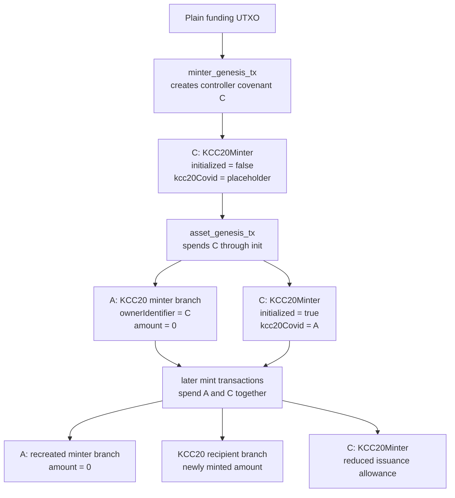

# KCC20 At A Glance

The example is split into two contracts with different responsibilities.

## KCC20

`KCC20` is the token state machine.

Each KCC20 covenant output represents token state with four fields:

- `ownerIdentifier`
- `identifierType`
- `amount`
- `isMinter`

The meaning of `ownerIdentifier` depends on `identifierType`.

- If `identifierType == IDENTIFIER_PUBKEY`, the owner identifier is a pubkey and a matching signature is required.
- If `identifierType == IDENTIFIER_SCRIPT_HASH`, the owner identifier is a P2SH script hash and the transaction must include an input whose scriptPubKey matches that hash.
- If `identifierType == IDENTIFIER_COVENANT_ID`, the owner identifier is a covenant ID and the transaction must include an input whose covenant ID matches it.

So the same token contract supports multiple ownership modes without changing the contract code.

`KCC20` also uses `isMinter` to distinguish ordinary token branches from mint-authorized branches.

- Ordinary branches must conserve supply.
- Minter branches may increase or decrease supply.

## KCC20Minter

`KCC20Minter` is the controller covenant used by this example. It controls issuance against a particular KCC20 covenant instance.

Its state is:

- `kcc20Covid`
- `amount`
- `initialized`

The field name `kcc20Covid` is just the name used in the example source. Functionally, it stores the KCC20 covenant ID that this minter controls.

`KCC20Minter` also carries template metadata for the KCC20 contract:

- `templatePrefixLen`
- `templateSuffixLen`
- `expectedTemplateHash`
- `templatePrefix`
- `templateSuffix`

That metadata lets the minter read and validate KCC20 state by template rather than blindly trusting that some output "looks like" a KCC20 output.

## Controller Covenant Terminology

This book uses **controller covenant** for the external policy covenant whose covenant ID owns a privileged KCC20 minter branch.

In this book, **issuance** means the policy governing when new token supply may be created; **minting** means the concrete transaction-level act of creating that supply.

In this example:

- `A` is the KCC20 asset covenant ID
- `C` is the controller covenant ID
- `KCC20Minter` is one concrete controller covenant implementation
- `owner` is the admin pubkey that signs controller actions

The distinction matters. The KCC20 minter branch is not owned by the admin pubkey directly. It is owned by covenant ID `C`. The admin key authorizes the `KCC20Minter` script, and that script decides how its authority over asset `A` may be used.

## How They Fit Together

The two contracts are meant to be read as one system.

KCC20 is the asset contract. It defines what a token state looks like, how ownership works, and when supply may or may not change.

KCC20Minter is the controller covenant. It does not redefine what a KCC20 token is. Instead, it binds itself to one KCC20 covenant instance and restricts how that particular KCC20 branch may be expanded over time.

So the relationship is:

- KCC20 answers: "what counts as a valid token transition?"
- KCC20Minter answers: "under what policy may new KCC20 tokens be issued?"

The contracts fit together through covenant-ID ownership, template validation, and a concrete transaction-level proof of control.

### Inter-Covenant Communication

These examples also illustrate a practical form of inter-covenant communication, often abbreviated as ICC.

The key constraint is that there is no `eval` mechanism here. One covenant cannot directly execute another covenant's code by reference inside the current script.

So when KCC20 wants to treat a token branch as "owned by another covenant", it uses a different proof model:

- the KCC20 state stores a covenant ID as the owner identifier
- the spending transaction must include an input owned by that covenant
- KCC20 checks that one of the chosen witness inputs has the matching covenant ID

In other words, the proof that "this token is owned by that contract" is not an abstract reference. The proof is that the KCC20 transaction actually spends a UTXO owned by that contract.

That is why covenant-ID ownership is so important in this example. It gives a concrete, transaction-level way for one covenant to demonstrate control over another covenant's state.

### Lifecycle

At a high level, the system is meant to work in three phases:

- a minter genesis phase, where the controller covenant is created and receives covenant ID `C`
- an asset genesis phase, where the KCC20 asset covenant is created with covenant ID `A`, while `C` binds itself to `A`
- an issuance phase, where KCC20 and KCC20Minter are spent together and each checks its side of the rules

The intended lifecycle is:

1. Spend a plain funding UTXO into an uninitialized `KCC20Minter`.
2. The minter genesis transaction creates the controller covenant ID `C` using normal covenant genesis hashing.
3. Spend `C` through `init`.
4. In the same asset genesis transaction, create:
   - a KCC20 minter branch with amount `0`
   - a new initialized minter output
5. The KCC20 minter branch is owned by `C`.
6. `init` stores the newly created KCC20 covenant ID `A` in the minter state.
7. Later, spend both contracts together:
   - the KCC20 minter branch
   - the KCC20Minter output
8. In each mint transaction, create:
   - a fresh zero-amount KCC20 minter branch
   - a separate KCC20 recipient output holding the newly minted amount
   - the next KCC20Minter output with reduced issuance allowance
9. KCC20 authorizes the token transition.
10. KCC20Minter verifies the issuance rule and decrements its remaining issuance allowance.

This means the token contract and the minter contract do not collapse into one script with one giant policy. They stay separate, and each one verifies the part of the transaction it is responsible for.

### Separation Of Responsibility

This cleanly separates concerns:

- KCC20 defines ownership and transfer semantics.
- KCC20Minter defines issuance policy.

That split is the main architectural point of the example. The token contract is reusable as a token state machine, while the minter contract provides one particular issuance model on top of it.

## System Diagram

```text
KCC20Minter
  |
  | governs issuance for
  v
KCC20
```

## Lifecycle Diagram


